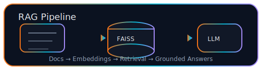
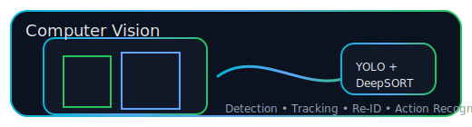

  

  

  <em>Building intelligent systems that are practical, accessible, and grounded in research.</em>

---

## 🌍 Identity

🎓 <b>B.S. in Computer Science & Engineering</b>, Kyungpook National University (2022–2026) 
📍 Daegu, South Korea 
🧠 AI Systems • LLMs • RAG • Web & Backend Engineering

---

## 🔗 Connect With Me

  
  
  
  

---

## 🚀 What I Build

🧠 **AI & LLM Systems**
- LLaMA, GPT-based applications
- RAG pipelines using LangChain & FAISS
- Prompt engineering & fine-tuning (Unsloth)

🕸️ **Web & Backend Engineering**
- FastAPI, Spring Boot
- RESTful APIs
- Dockerized deployment (AWS EC2, NGINX)

👁️ **Computer Vision & Surveillance AI**
- YOLO, DeepSORT
- ST-GCN (Action Recognition)
- FaceNet & OSNet (Person Re-ID)

☁️ **Cloud & APIs**
- Google Cloud (STT, TTS, Maps)
- Hugging Face Hub
- Git & GitHub

---

## 🧠 LLM & RAG Systems

- Designed and deployed **production-grade RAG systems**
- Built retrieval pipelines to reduce hallucinations
- Integrated vector databases with FastAPI backends
- Focus on reliability, latency, and real-user interaction

---

## 👁️ Computer Vision & Behavior Analysis

- Multi-person tracking using YOLO + DeepSORT
- Cross-camera identity matching with OSNet
- Action recognition using ST-GCN
- Applied to real CCTV-style datasets

---

## 📚 Research & Publications

### 🏆 UCWIT 2024 (KIISE-hosted) — Excellent Paper Award  
**Title:** *Evaluating LLaMA Model for Enhanced Conversational AI in Voice Recognition Kiosks*  
**Ranking:** Top 4 / 47 teams  

**Research Focus**
- Comparative evaluation of **LLaMA vs RASA**
- Handling ambiguity, multi-intent, and recovery
- Realistic kiosk-style conversational scenarios

**My Contributions**
- Designed evaluation methodology
- Built conversational test datasets
- Analyzed system failure modes
- Co-authored paper & presentation

🔗 Paper / Repo: *(to be added)*  
📌 Slides / Poster: *(to be added)*

---

## 🏆 Selected Projects

### 🤖 SheBots — AI RAG Chatbot (Production)
- Deployed on AWS using FastAPI, Docker, NGINX
- Real users accessing university information
- Full backend & AI pipeline ownership

### 🗣️ AI Voice-Driven Cafe Kiosk
- LLaMA-based conversational ordering
- Handles complex and ambiguous orders
- Prompt engineering & fine-tuning

### 🚌 Accessible Public Transportation Kiosk (길:벗 / VisOned)
- Voice-driven navigation for elderly users
- Google Maps + STT/TTS integration
- Human-centered design focus

### 📹 Multi-CCTV Behavior Analysis System
- Detection, tracking, re-identification
- Action recognition pipeline
- Performance evaluation on real datasets

---

## 🏅 Achievements

🏆 **UCWIT 2024 – Excellent Paper Award**  
🎓 **Global Korea Scholarship (2022)**  
🥈 **International Student Talent Show – 2nd Prize**

---

## 🛠 Tech Stack Snapshot

  

---

## 📊 GitHub Activity

  
  

  

---

  <strong>“I don’t just build projects — I design systems that think.”</strong>

  

